# FreeBot Programming Guide

The document is meant to act as a guide to help navigate coding the FreeBot with no prior experience of programming it.

## FreeBot Software Breakdown

### Visual Studio (VS) Code

A code editor that is able to run on multiple operating systems, and supports multiple programming languages by use of numerous extensions. This will allow us to write code in both C and Python, as well as build and flash it using the nRF extension for VS code, making it more easy to operate compared to the nRF Connect for Desktop software. 

### pyOCD

pyOcd is an open source project that offers a Python interface and command-line utility for interacting with ARM Cortex-M Microcontrollers over the CMSIS-DAP protocol.  
Refer to the code base to find commands that use pyOCD to reset, debug, flash, check the status of the FreeBot and the DK board.

### nRF Connect for VS Code

This extension pack allows developers to use the VS Code IDE to develop, build and debug applications for various Nordic Semiconductors DK boards on various operating systems. This is much more convenient than using the nRF Connect for Desktop software as the command line interface, with a built in terminal and graphical user interface is available in one place. 

### Python

Python extensions allow us to interface the FreeBot with our custom Python-based GUI, allowing us to control the FreeBot through an intuitive GUI instead of a terminal interface.   
We can also look into websocket integration similar to that of the e-Pucks for future implementations and studies. 

## FreeBot Installation Requirements

*The following software, dependencies, and extensions need to be installed to operate the FreeBot, and the nRF52840 development kit board:*

1. Latest version of VS code:  
- [Click on this link](https://code.visualstudio.com/download) for download directions

*Be sure to download the latest version and the one most appropriate for your OS*  
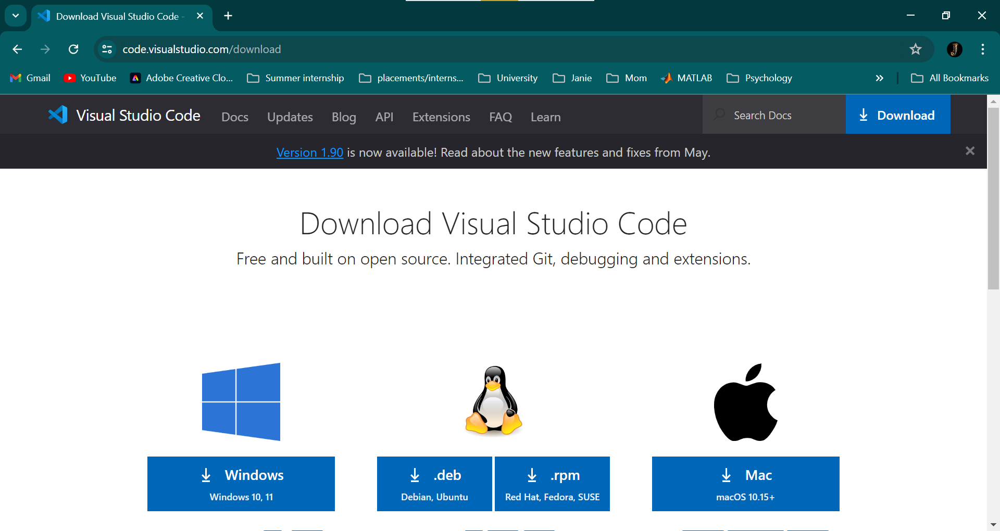
For windows, simply open the .exe file downloaded, and follow the steps on- screen instructions for installing the software

For Linux, run the following command in Terminal to install the .deb package

```sh
# Navigate to the location where the package was downloaded
$ cd Downloads/

# Run the following command, replacing the file name
$ sudo dpkg -i <DEB_PACKAGE_NAME>.deb
```

2. Install the following extensions:  
- nRF Connect for VS Code Extension Pack  
- Serial Monitor  
- Python, Python Debugger, Pylance(optional)

	*Follow these instructions to find and install the extensions*  
    1. Open VS Code and navigate to the Extensions tab on the left panel			
		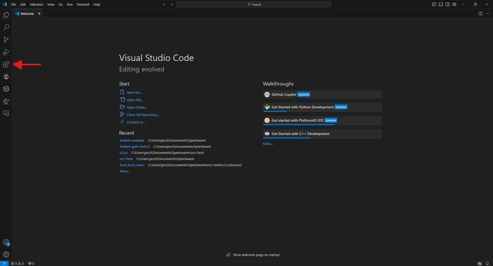


    2. Search for the nRF Connect for VS Code Extension Pack and click Install  
		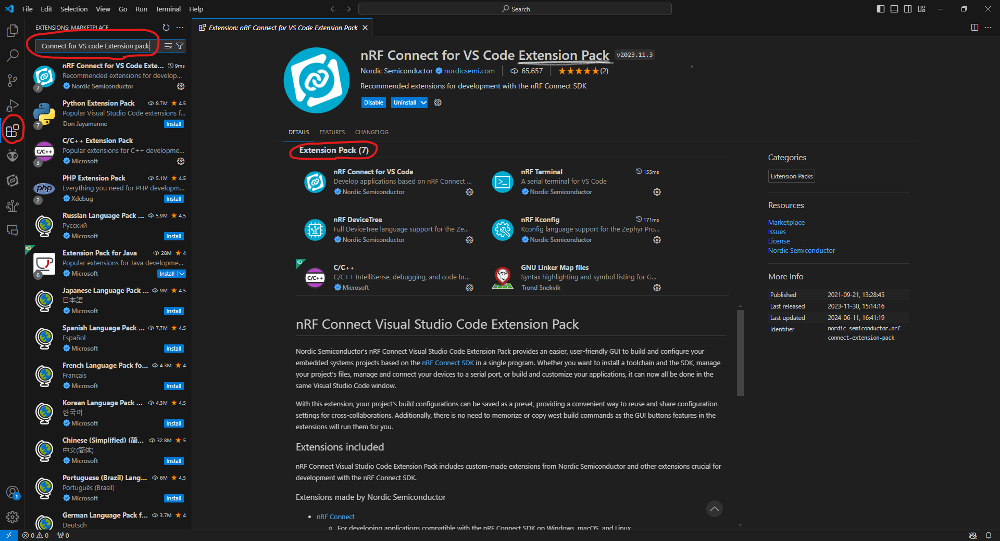
  
	*Without the extension pack, each of the extensions would need to installed individually (total of 7\)*

    3. Repeat step 2 for the other extensions:  
		
	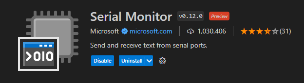
  
	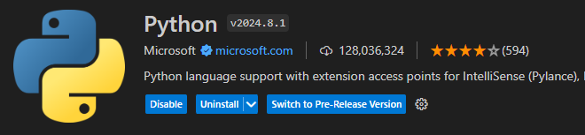

	*Be careful to install the official release of the extensions, as many other versions also exist*  
		  
3. Install pyOCD on your system by running the following commands in your terminal     ([A Python3 installation on your system is a prerequisite](https://www.python.org/downloads/))

```sh
# update pip to the latest version
$ pip install --upgrade pip

# install pyocd
$ pip install pyocd
# if you have python3 installed, use the following instead
$ pip3 install pyocd
```

4. Install nRF Command Line Tools  
   - [Click on this link](https://www.nordicsemi.com/Products/Development-tools/nRF-Command-Line-Tools/Download) for download directions

		*Be sure to download the latest version and the one most appropriate for your OS*  

	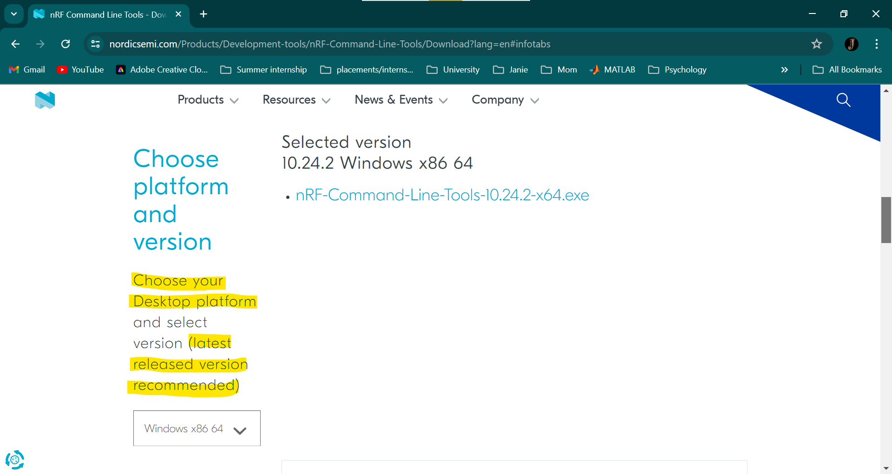	 
 

5. Install the Segger J-Link Software   
   - [Click on this link](https://www.segger.com/downloads/jlink/#J-LinkSoftwareAndDocumentationPack) for download directions

		*Be sure to download the latest version and the one most appropriate for your OS*  

	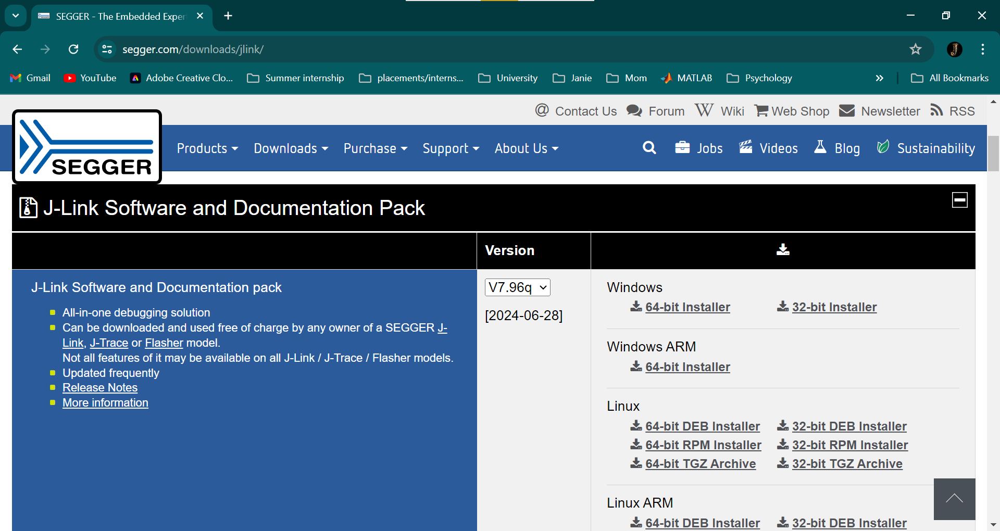	

***The following steps are an alternative to Steps 1 \- 5\. Note: The use of VS Code is preferred over the nRF interface, and therefore, is the one we are using for development***

6. Install nRF Connect for Desktop  
   - [Click on this link](https://www.nordicsemi.com/Products/Development-tools/nRF-Connect-for-Desktop/Download#infotabs) for download directions

		*Be sure to download the latest version and the one most appropriate for your OS*

7. Install nRF Command Line Tools  
   - [Click on this link](https://www.nordicsemi.com/Products/Development-tools/nRF-Command-Line-Tools/Download) for download directions

		*Be sure to download the latest version and the one most appropriate for your OS*  

		

8. Install the Toolchain Manager, Serial Terminal, Bluetooth Low Energy, Programmer and Board Configurator from the Apps tab on the nRF Connect for Desktop Software  
   
	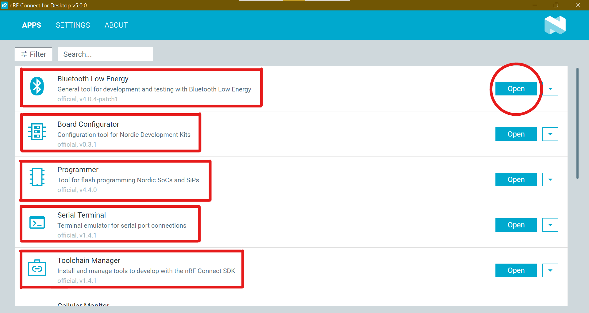	

## VS Code set-up

1. Navigate to the the nRF Connect Extension from the sidebar menu  
	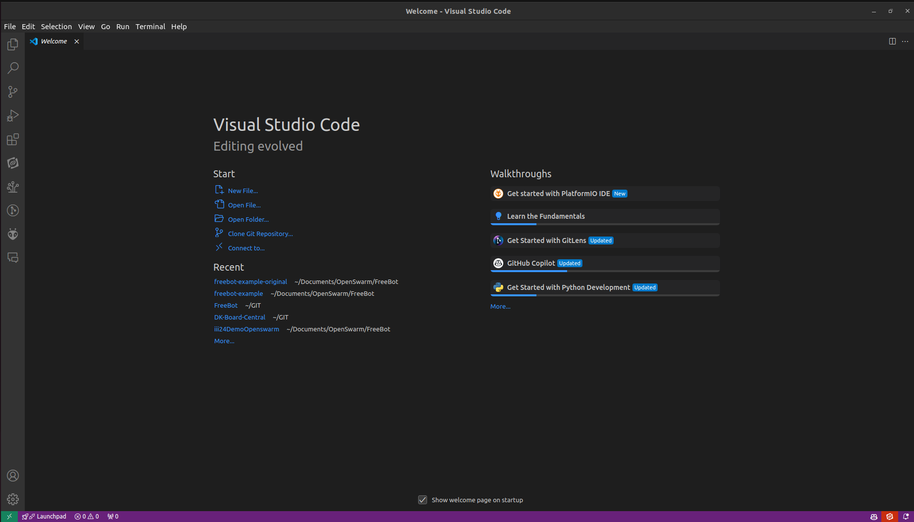	
     
2. Select to install a toolchain  
	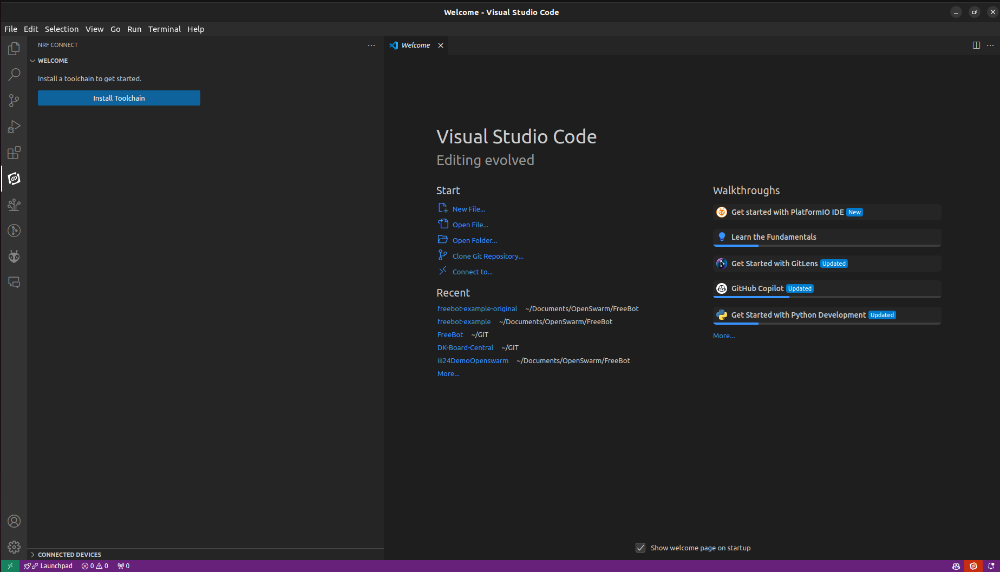	

3. Install the latest toolchain version available (I will be installing v2.6.1, due to support of SDK being experimental)

	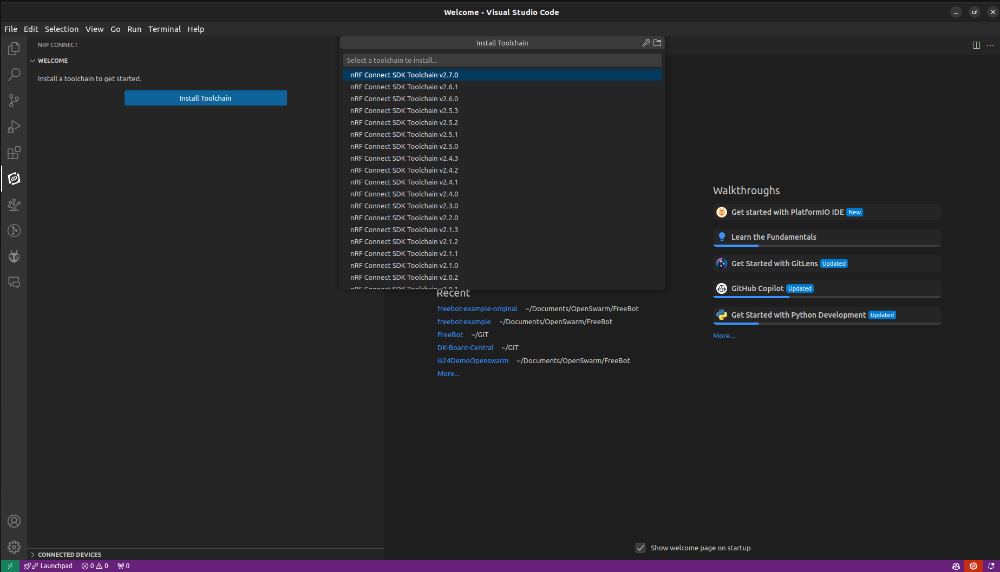	

4. Select Manage SDKs to install an SDK version (the version of the SDK installed should be the same as the toolchain)  
	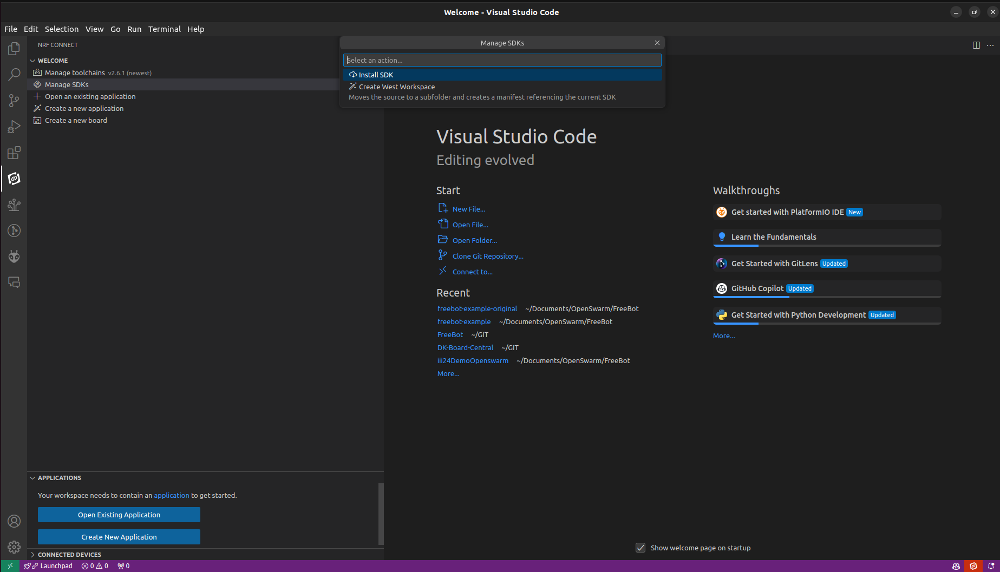	
     
5. Install the SDK in the default location suggested by VS Code  
	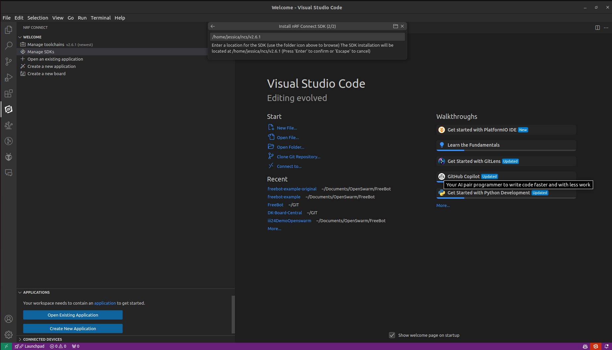	

## Basic FreeBot Demo {#basic-freebot-demo}

1. Navigate to the directory where you would like to create your project via terminal  
2. Clone [this git repository](https://github.com/LMY-Mengyao/freebot-example) using the following command

```sh
$ git clone https://github.com/LMY-Mengyao/freebot-example.git
```

3. Download the required submodule using the following command

```sh
$ git submodule update --init
```

4. Open the git repo into your VS Code workspace
	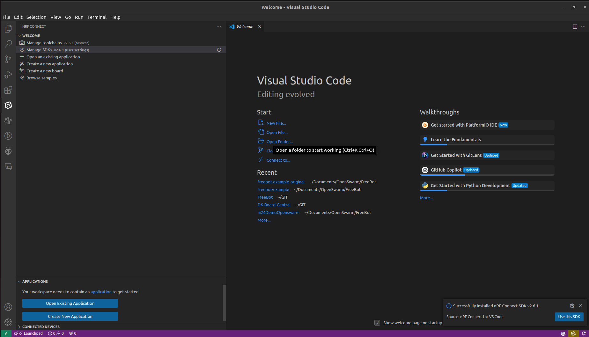	
	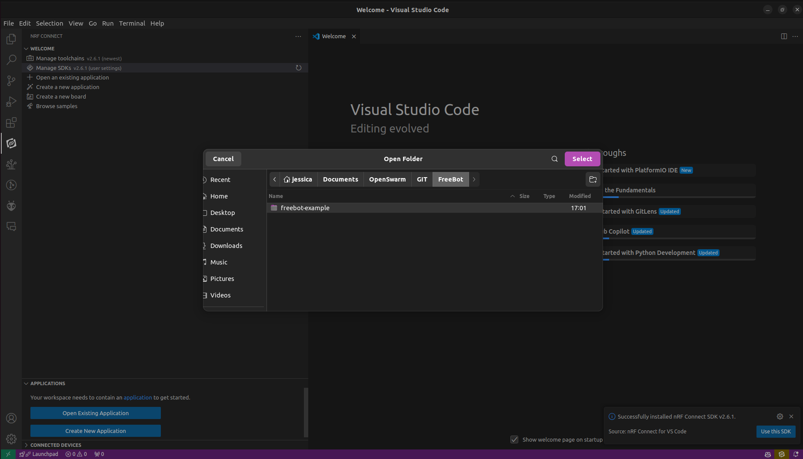	

5. Add a build configuration from the application section of the nRF Connect and choose custom boards to find the FreeBot configuration  
	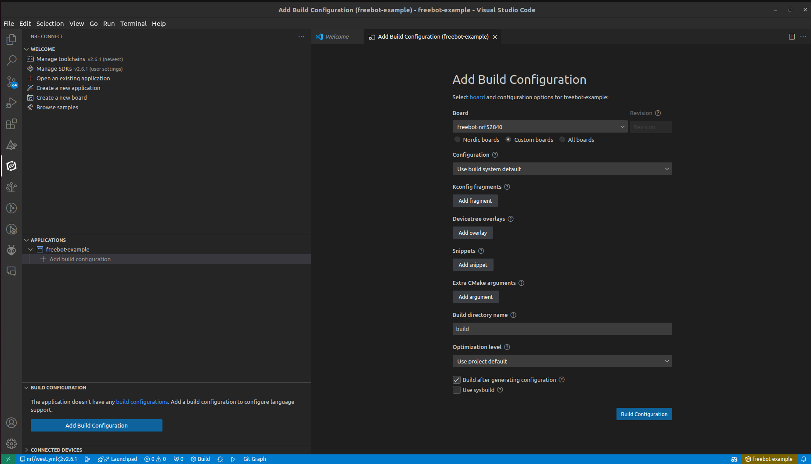 
     
6. Compile the code using the Build option from the Action centre on the left hand side menu  
	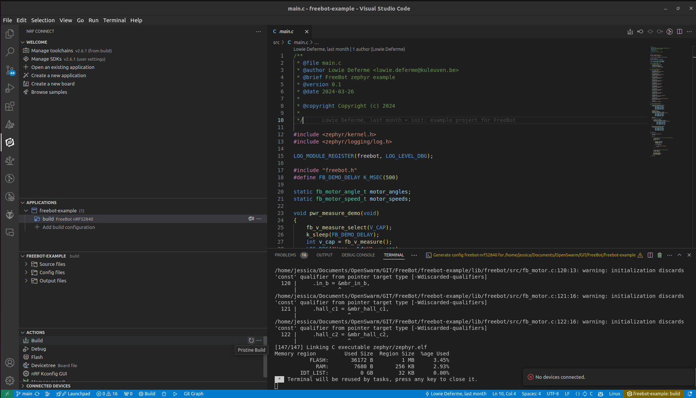
   Upon a successful build, you will see some memory information outputted to the terminal  
     
7. Open a new terminal window and navigate to the project directory  
	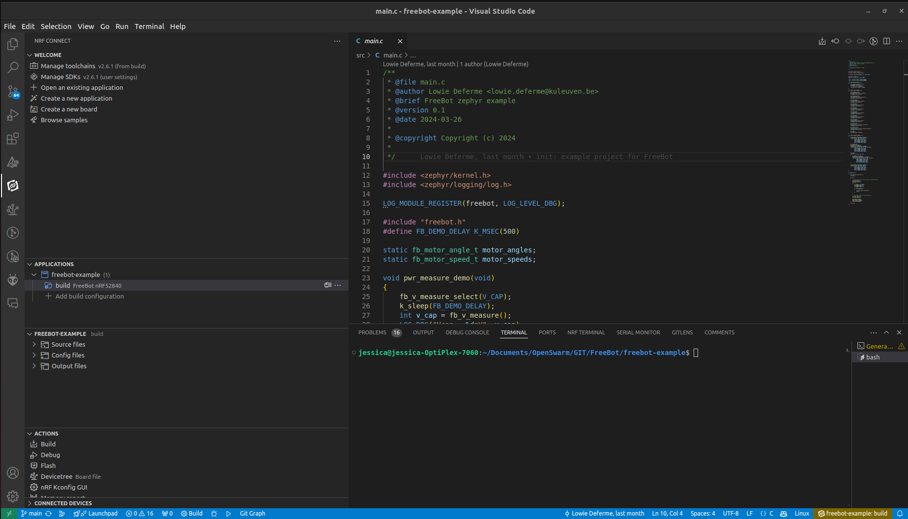
     
8. Flash the code onto the FreeBot (refer to the [code base](#code-base) for the commands)  
   - If you are on a Linux system, you might need a virtual environment before you are able to execute python commands in terminal  
    
9. Upon successful flashing, the blue lights on the FreeBot should toggle on and off. Press the button labelled SW2 (directly above flashing LEDs) to execute the movement demonstration. You can open a serial monitor display and connect to the port the FreeBot is attached to, with a baud rate of 115200, to view the voltage, motor angles and rpm values.

## [FreeBot GitHub Repository Guide](https://github.com/jessicajayakumar/FreeBot.git)

### Main

#### boards/arm/freebot-nrf52840

***This folder contains the build configuration files for the FreeBot. Do not change anything in this folder.***

When building an application for the FreeBot, copy this folder into the workspace, so the nRF Connect extension is able to view this file as an option as a device, and create the Freeot-specific build configuration for programming the FreeBot

#### lib/freebot

***This file contains the FreeBot configuration information needed to program the FreeBot. Do not change anything in this folder.***

When programming the FreeBot, refer to the various C and header files to direct the FreeBot to perform various tasks, ranging from motor control, to voltage and rpm measurements.

#### central\_uart

Contains the code for the central device as provided by the official Nordic Semiconductor sample for testing functionality of the central device, and successful bluetooth connectivity and data transmission from the serial terminal via UART.

To run this sample, open this folder in VS code and add a build configuration from the nRF Connect extension for the DK board under the name nrf52840dk\_nrf52840.  
Upload the compiled code in the zephyr.hex file using [this command.](#bookmark=id.tl5eirywli34)

#### peripheral\_uart

##### src

Contains the code for the peripheral device(FreeBot), as provided by the official Nordic Semiconductor sample for testing functionality of the FreeBot, and successful bluetooth connectivity and data transmission from the serial terminal over UART

To run this sample, open this folder in VS code. Copy the FreeBot build configuration folder into the same project space, and refresh the workspace to update the folder structure.   
Add the FreeBot build configuration from the nRF Connect extension under the name freebot-nrf52840.  
Upload the compiled hex file to the FreeBot using [this command.](#bookmark=id.tl5eirywli34) 

***For testing the central and peripheral UART samples, open two serial terminal windows from the [nRF Connect for Desktop application](https://www.nordicsemi.com/Products/Development-tools/nRF-Connect-for-Desktop), and connect to each device’s serial port. If the devices are connected, the blue LED on the FreeBot and LED 1 on the DKB will turn ON.   
Information can be passed between the two devices by typing it into the terminal and sending it to the serial port. The message should be received and outputted on the other device’s serial terminal.***

#### python

This folder contains all the code files for the FreeBot demo videoed for the KU Leuven all-hands meeting in June. The code integrates SCT into the functioning of the robot. However, the SCT is implemented locally on the PC in this version, rather than on the FreeBot. 

## [DK Board Github Repository Guide](https://github.com/jessicajayakumar/DK-Board-Central.git)

### main

Contains the same files as the central\_uart folder in the main branch of the Github repository.

### multi\_conn 

#### src

##### main.c 

This code is meant to be compiled and uploaded to the DK board. This code has been altered from older versions to allow for a maximum of 20 Bluetooth connections. Follow [the instructions here](#basic-freebot-demo) to compile and upload the code

##### dkb\_fb\_gui.py

This is the python script that runs the GUI that allows us to remote operate multiple FreeBots. When run, the following GUI will appear. Prior to operating the GUI, the respective codes for the DK board and the FreeBot needs to have been uploaded, and the devices should have established a connection. Prior testing with an nRF Connect for Desktop serial terminal before activating the GUI is advised. In the case of loss of connectivity, wait for the FreeBots to connect on their own. If they do not, it is possibly an issue with low battery, so recharge the FreeBot and reupload the code before proceeding.

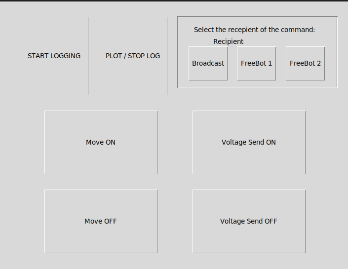

- START LOGGING: Opens the serial port and reads the data being output and writes this information to a file called serial\_log.txt  
- PLOT / STOP LOG: Stops reading and writing the data printed to the serial port. However, the port remains open so commands for activating/deactivating movement and voltage transmission can still be communicated to the FreeBots  
- The frame on the top left corner allows us to select the intended recipient of a command before being able to transmit said command. The selected recipient is then displayed via a label, so we are aware of the selected recipients. This is not a once-only variable. This value, once chosen, will remain the same until changed  
- Move ON : Sends a command to set the move flag to true so the FreeBot can execute it’s random motion  
- Move OFF: Sends a command to set the move flag to false so the FreeBot stops moving  
- Voltage Send ON: Sends a command to send the set the voltage send flag to true so the FreeBot is able to read and send voltages back to the PC  
- Voltage Send OFF: 

When PLOT / STOP LOG is clicked, the below output will be produced shortly after the program filters the data logged based on which FreeBot the battery information belongs to.  

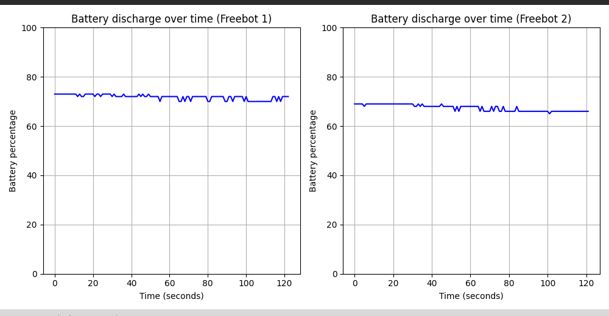 

The above graphs represent the drop in the battery percentage over time. The 100% battery level is assumed to be 3000mV, as per the specification of the supercapacitors attached to the FreeBots.

## FreeBot Energy monitoring 

### Serial port based

*The maximum battery potential reported by a FreeBot (based on output from the code, immediately after recharging \- may vary slightly each time) is **2840mV***

The following code can be used to read the value of the remaining energy value of the FreeBot in millivolts:

```c
void pwr_measure_demo(void){
	fb_v_measure_select(V_CAP);
	k_sleep(FB_DEMO_DELAY); 
	int v_cap =  fb_v_measure();
	LOG_DBG("Vcap=%d mV", v_cap);
}

/* This uses the logging function of zephyr to log the voltage levels of the supercapacitor, printing them to the serial monitor in 1 second intervals */
```

***However, the above code requires a serial port connection with the FreeBot as these values are printed to the Serial Monitor periodically.***

## Appendix

### Code Base  {#code-base}

#### Terminal commands (Windows \+ Linux)

1. List the available targets connected to the system

```sh
$ pyocd list
```

2. Reset the hardware or software of a device

```sh
$ pyocd reset
```

3. Erase all internal flash or a range of sectors

```sh
$ pyocd erase -t nrf52840 --chip 
```

4. Load a binary, hex, or elf file with optional base address 

```sh
$ pyocd load -t nrf52840 <path to file> [build/zephyr/zephyr.hex]
# Either specify the path to file, or navigate to the folder containing the file before loading the program 
```

### Troubleshooting

#### Cannot execute pyocd command in terminal

```sh
# Install pip module 
$ sudo apt-get install -y python3-pip

# Install the python virtual environment package
$ sudo apt-get install -y python3-venv

# Create a virtual environment in your home directory
$ python -m venv [name of venv, eg.venv]

# Activate the virtual environment
$ source [venv name]/bin/activate

# To deactivate
$ deactivate
```

#### FreeBot not visible when running ‘pyocd list’

If the FreeBot is fully charged, and the cable connected to the PC is fully functional, there is a possibility that the CMSIS DAPLink package is not installed

```py
# Navigate to your home directory
$ cd ~

# Navigate to the following directory
$ cd /etc/udev/rules.d

# Use 'ls' to search for a file named 50-cmsis-dap.rules
# If not found,that's the missing file required for the pc to see the FB

```

[This Github repository](https://github.com/pyocd/pyOCD/blob/main/udev/README.md) holds the required .rules file for the FB to be visible via pyocd under the same name (50-cmsis-dap.rules).  
Copy that file into the above directory, and run this final command to reload the udev system as an alternative to rebooting the system.

```sh
$ sudo udevadm control --reload
$ sudo udevadm trigger
```

When running ‘pyocd list’ again, the FreeBot should be visible on the list of available target devices
